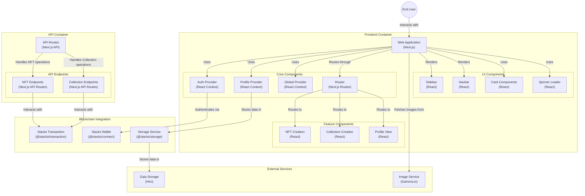

<<<<<<< Updated upstream
# LiteNFT Project - Fronted

This is a [Next.js](https://nextjs.org) project bootstrapped with [`create-next-app`](https://nextjs.org/docs/app/api-reference/cli/create-next-app).
=======
<p align="center"><a href="https://github.com/joelvegas20/lite-nft-frontent.git" target="_blank"></a></p>
>>>>>>> Stashed changes

# LiteNFT Frontend

[](https://nextjs.org/)

LiteNFT Frontend is a web application built with Next.js that provides a user interface to interact with the NFT marketplace. This project allows users to explore, buy, and sell non-fungible tokens seamlessly and intuitively.

## Features

- **NFT Exploration**: Browse through a wide collection of NFTs available in the marketplace.
- **Buy and Sell**: Facilitates secure purchasing and selling of NFTs.
- **Intuitive Interface**: Modern and user-friendly design optimized for a smooth user experience.
- **Wallet Integration**: Connect with various digital wallets to manage your assets.

- **Create Collection**: To create a collection, we follow a similar approach to creating an NFT. The process involves tracking the collections created via the platform. Refer to the smart contract repository for more details: [LiteNFT Project - Smart Contracts](https://github.com/stacks-training/lite-nft-collection). The key aspect here is the use of [Gaia Storage](https://docs.stacks.co/concepts/gaia) to store the collection metadata.

   The workflow is as follows:
    1. The function `createCollection` in `@/lib/createCollection.ts` receives the collection name, description, and image from the metadata
    
    2. So first the image is uploaded to [gaia](https://docs.stacks.co/concepts/gaia)
         ```js
         const uploadImage = async (
         collectionName: string,
         collectionImage: File,
         ) => {
         // this return the url of the upload image into the gaia storage
         return await storage.putFile(
            `${collectionName}-image`,
            collectionImage as File,
            {
            encrypt: false,
            });
         };
         ```
    3. Then the collection is registered in the smart contract, through the ublic function `create-collection`
         ```js
         export const createCollection = async ({
         collectionName,
         collectionDescription,
         collectionImage,
         }: createCollectionProps) => {
         const imageURL = await uploadImage(collectionName, collectionImage as File);
         await openContractCall({
            contractAddress: 'ST3GBYD0VN28MAPDGNGTFNXQV5QJXQ3VCV3WZT75T',
            contractName: 'collection-v5',
            functionName: 'create-collection',
            functionArgs: [stringAsciiCV(collectionName), stringAsciiCV(collectionDescription), stringAsciiCV(imageURL)],
            network: 'testnet',
            onFinish: (data) => {
            console.log('Data:', data);
            },
            onCancel: () => {
            console.log('User cancelled the transaction');
            },
         });
         };
         ```

   This ensures that the collection is properly created and stored, making it accessible for future reference and use.
    
 - **Create NFT**: To create a NFT, in the sense of building a gallery we adopted a approach of keeping track of whatever we create via the platform. Checkout the smart contract repository to see how this works [LiteNFT Project - Smart Contracts](https://github.com/stacks-training/lite-nft-collection). The crux here is usage of [Gaia Storage](https://docs.stacks.co/concepts/gaia) to save the image and the nft that behalf the new NFT. 
  
   To get this done we've the following workflow:
    1. The function `createNFT` at `@/lib/createNFT.ts` recieves from the fronted the metadata, the image, NFT's name and the collection it belongs to. 

    2. So first the image is uploaded to [gaia](https://docs.stacks.co/concepts/gaia) in order to correctly fill up the [SIP016](https://github.com/stacksgov/sips/blob/main/sips/sip-016/sip-016-token-metadata.md) format
        ```js
        const uploadImage = async (
        NFTName: string,
        NFTLogo: File,
        ) => {
        // this return the url of the upload image into the gaia storage
        return await storage.putFile(
           `${NFTName}-image`,
           NFTLogo as File,
           {
           encrypt: false,
           }
        );
        };
        ```     
    3. Then the metada, which is a csv (that follows the [format](https://support.gamma.io/hc/en-us/articles/6011142909971-What-is-the-correct-format-for-Stacks-NFT-metadata-CSV-files) that gamma accepts) is loaded and parsed using [csv-parser](https://www.npmjs.com/package/csv-parser) package
        >Is important to note that the csv must have a header with the value's names and a single row for the actual values. The rest of the rows will not be considered
        ```js
        // Function to parse the incoming csv file with the metadata
        export const parseCSV = async (csvContent: string): Promise<ParsedCSVRecord> => {
        return new Promise((resolve, reject) => {
            const results: any[] = [];
            const stream = Readable.from([csvContent]);
            stream
            .pipe(csvParser())
            .on('data', (data) => results.push(data))
            .on('end', () => {
                resolve(results[0]);
            })
            .on('error', (error) => reject(error));
        });
        };
        ```
        Then we exert the function genertate metatadata, correctly generating a json metada file, that is uploaded to [gaia](https://docs.stacks.co/concepts/gaia)
        ```js
        const generateMedatada = ({
            name,
            collection,
            attributes,
            asset_type,
            image
        }: MetadataProps) => {
            let trait_value: { trait: string; value: string }[] = [];
            // generate the trait-value pairs
            Object.entries(attributes).forEach(([key, value]) => {
                trait_value.push({
                "trait": key,
                "value": value
                });
            });
            // return the actual json metadata object
            return {
                "sip": 16,
                "name": name,
                "properties": {
                "collection": collection
                },
                "attributes": trait_value,
                "asset_type": asset_type,
                "image": image
            }
        };
        ```

    4. Finally the NFT is registered in the smart contract, using the `create-nft` function.
        ```js
        openContractCall({
                contractAddress: 'ST3GBYD0VN28MAPDGNGTFNXQV5QJXQ3VCV3WZT75T',
                contractName: 'collection-v5',
                functionName: 'create-nft',
                // name - attributes of the nft[URI] - image[URI] - collection-id
                functionArgs: [stringAsciiCV(NFTName), stringAsciiCV(nftAttrURL), stringAsciiCV(nftLogoURL), uintCV(collectionId)],
                network: 'testnet',
                onFinish: (data) => {
                console.log('Data:', data);
                },
                onCancel: () => {
                console.log('User cancelled the transaction');
                },
            });
        ```

    This ensures that the NFT is properly created and stored, making it accessible for future reference and use.

## Prerequisites

Before getting started, ensure you have the following installed:

- [Node.js](https://nodejs.org/) (version 14 or later)
- [npm](https://www.npmjs.com/) or [yarn](https://yarnpkg.com/)

## Installation

Follow these steps to set up the development environment:

1. **Clone the repository**:

   ```bash
   git clone https://github.com/joelvegas20/lite-nft-frontent.git
   cd lite-nft-frontent
   ```

2. **Install dependencies**:

   Using npm:

   ```bash
   npm install
   ```

   Or using yarn:

   ```bash
   yarn install
   ```

## Usage

To start the development server, run:

Using npm:

```bash
npm run dev
```

Or using yarn:

```bash
yarn dev
```

Then open [http://localhost:3000](http://localhost:3000) in your browser to see the application running.

## Available Scripts

- `dev`: Starts the development server.
- `build`: Builds the application for production.
- `start`: Runs the application in production mode.

## Project Structure

```plaintext
lite-nft-frontent/
├── public/                 # Static files
├── src/
│   ├── app/
│   │   ├── api/            # API routes
│   │   ├── components/     # Reusable components
│   │   │   └── global/     # Global components
│   │   ├── create-collection/ # NFT collection creation
│   │   ├── create-nft/     # NFT creation
│   │   ├── fonts/          # Font files
│   │   ├── profile/        # User profile-related pages
│   │   ├── test/           # Test files
│   │   ├── utils/          # Utility functions
│   ├── context/            # React context files
│   ├── lib/                # Shared libraries or helpers
│   ├── ui/                 # UI components
├── .eslintrc.json          # ESLint configuration
├── next.config.js          # Next.js configuration
├── package.json            # Project dependencies and scripts
└── README.md               # Project **documentation**
```

## Contribution

If you want to contribute to LiteNFT Frontend, please follow these steps:

<<<<<<< Updated upstream
Check out our [Next.js deployment documentation](https://nextjs.org/docs/app/building-your-application/deploying) for more details.


## Modules

### Create Collection

To create a collection, we follow a similar approach to creating an NFT. The process involves tracking the collections created via the platform. Refer to the smart contract repository for more details: [LiteNFT Project - Smart Contracts](https://github.com/stacks-training/lite-nft-collection). The key aspect here is the use of [Gaia Storage](https://docs.stacks.co/concepts/gaia) to store the collection metadata.

The workflow is as follows:
1. The function `createCollection` in `@/lib/createCollection.ts` receives the collection name, description, and image from the metadata
2. So first the image is uploaded to [gaia](https://docs.stacks.co/concepts/gaia)
    ```js
    const uploadImage = async (
    collectionName: string,
    collectionImage: File,
    ) => {
    // this return the url of the upload image into the gaia storage
    return await storage.putFile(
        `${collectionName}-image`,
        collectionImage as File,
        {
        encrypt: false,
        });
    };
    ```
3. Then the collection is registered in the smart contract, through the ublic function `create-collection`
    ```js
    export const createCollection = async ({
    collectionName,
    collectionDescription,
    collectionImage,
    }: createCollectionProps) => {
    const imageURL = await uploadImage(collectionName, collectionImage as File);
    await openContractCall({
        contractAddress: 'ST3GBYD0VN28MAPDGNGTFNXQV5QJXQ3VCV3WZT75T',
        contractName: 'collection-v5',
        functionName: 'create-collection',
        functionArgs: [stringAsciiCV(collectionName), stringAsciiCV(collectionDescription), stringAsciiCV(imageURL)],
        network: 'testnet',
        onFinish: (data) => {
        console.log('Data:', data);
        },
        onCancel: () => {
        console.log('User cancelled the transaction');
        },
    });
    };
    ```

This ensures that the collection is properly created and stored, making it accessible for future reference and use.
    
### Create NFT

To create a NFT, in the sense of building a gallery we adopted a approach of keeping track of whatever we create via the platform. Checkout the smart contract repository to see how this works [LiteNFT Project - Smart Contracts](https://github.com/stacks-training/lite-nft-collection). The crux here is usage of [Gaia Storage](https://docs.stacks.co/concepts/gaia) to save the image and the nft that behalf the new NFT. 
To get this done we've the following workflow:
1. The function `createNFT` at `@/lib/createNFT.ts` recieves from the fronted the metadata, the image, NFT's name and the collection it belongs to. 

2. So first the image is uploaded to [gaia](https://docs.stacks.co/concepts/gaia) in order to correctly fill up the [SIP016](https://github.com/stacksgov/sips/blob/main/sips/sip-016/sip-016-token-metadata.md) format
    ```js
    const uploadImage = async (
    NFTName: string,
    NFTLogo: File,
    ) => {
    // this return the url of the upload image into the gaia storage
    return await storage.putFile(
        `${NFTName}-image`,
        NFTLogo as File,
        {
        encrypt: false,
        }
    );
    };
    ```     
3. Then the metada, which is a csv (that follows the [format](https://support.gamma.io/hc/en-us/articles/6011142909971-What-is-the-correct-format-for-Stacks-NFT-metadata-CSV-files) that gamma accepts) is loaded and parsed using [csv-parser](https://www.npmjs.com/package/csv-parser) package
    >Is important to note that the csv must have a header with the value's names and a single row for the actual values. The rest of the rows will not be considered
    ```js
    // Function to parse the incoming csv file with the metadata
    export const parseCSV = async (csvContent: string): Promise<ParsedCSVRecord> => {
    return new Promise((resolve, reject) => {
        const results: any[] = [];
        const stream = Readable.from([csvContent]);
        stream
        .pipe(csvParser())
        .on('data', (data) => results.push(data))
        .on('end', () => {
            resolve(results[0]);
        })
        .on('error', (error) => reject(error));
    });
    };
    ```
    Then we exert the function genertate metatadata, correctly generating a json metada file, that is uploaded to [gaia](https://docs.stacks.co/concepts/gaia)
    ```js
    const generateMedatada = ({
        name,
        collection,
        attributes,
        asset_type,
        image
    }: MetadataProps) => {
        let trait_value: { trait: string; value: string }[] = [];
        // generate the trait-value pairs
        Object.entries(attributes).forEach(([key, value]) => {
            trait_value.push({
            "trait": key,
            "value": value
            });
        });
        // return the actual json metadata object
        return {
            "sip": 16,
            "name": name,
            "properties": {
            "collection": collection
            },
            "attributes": trait_value,
            "asset_type": asset_type,
            "image": image
        }
    };
    ```

4. Finally the NFT is registered in the smart contract, using the `create-nft` function.
    ```js
    openContractCall({
            contractAddress: 'ST3GBYD0VN28MAPDGNGTFNXQV5QJXQ3VCV3WZT75T',
            contractName: 'collection-v5',
            functionName: 'create-nft',
            // name - attributes of the nft[URI] - image[URI] - collection-id
            functionArgs: [stringAsciiCV(NFTName), stringAsciiCV(nftAttrURL), stringAsciiCV(nftLogoURL), uintCV(collectionId)],
            network: 'testnet',
            onFinish: (data) => {
            console.log('Data:', data);
            },
            onCancel: () => {
            console.log('User cancelled the transaction');
            },
        });
    ```
This ensures that the NFT is properly created and stored, making it accessible for future reference and use.

### Architecture diagram


```
=======
1. **Fork** the repository.
2. Create a **branch** for your new feature or bug fix (`git checkout -b feature/new-feature`).
3. Make your **changes** and **commit** them (`git commit -m 'Add new feature'`).
4. **Push** your changes to your fork (`git push origin feature/new-feature`).
5. Open a **pull request** in this repository.

## Additional Resources

- [Next.js Documentation](https://nextjs.org/docs)
- [JavaScript Style Guide](https://github.com/airbnb/javascript)
>>>>>>> Stashed changes
